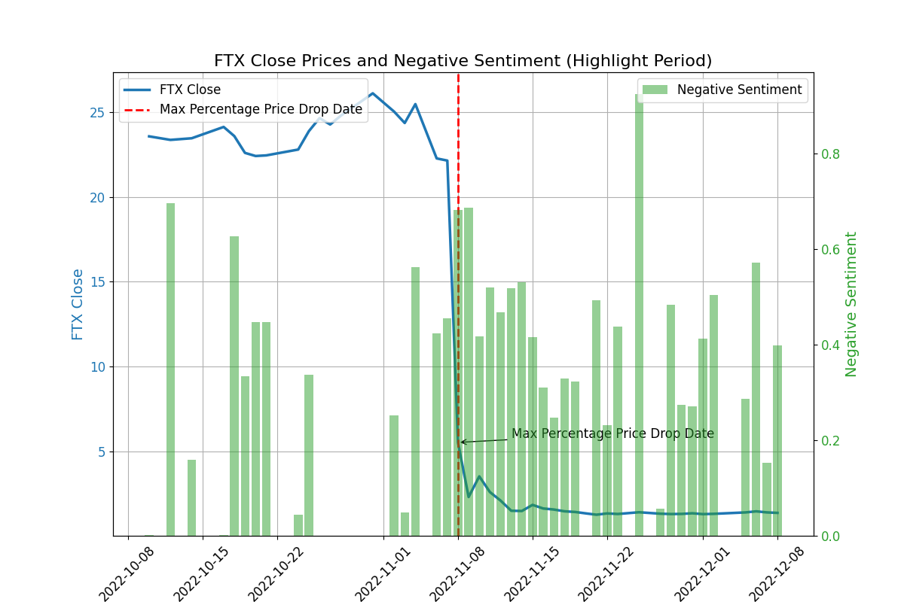
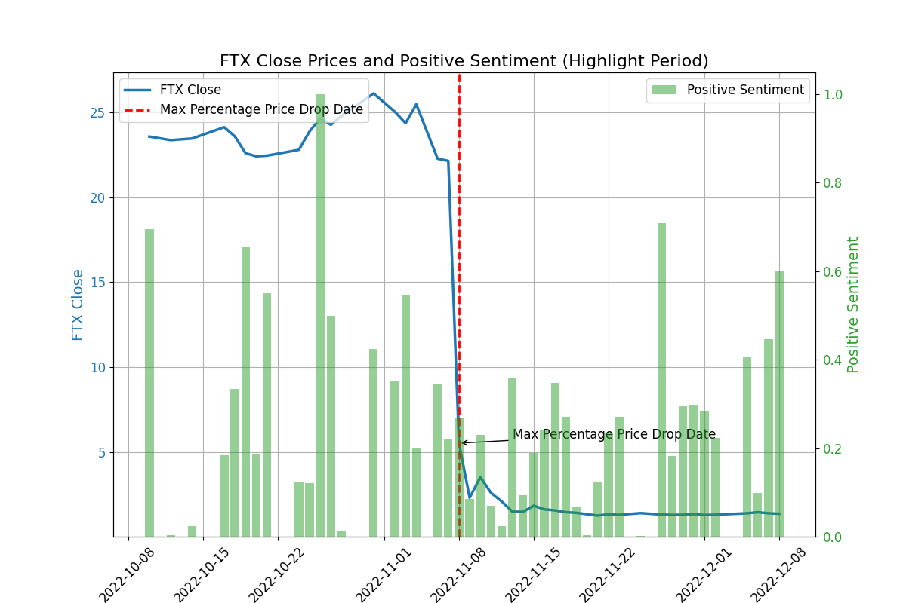
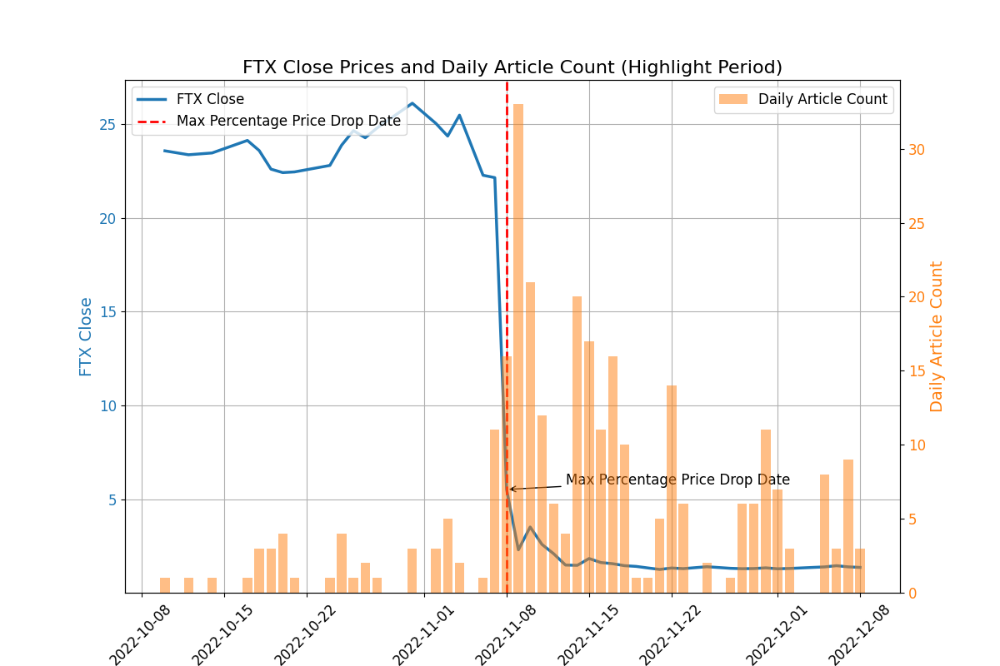
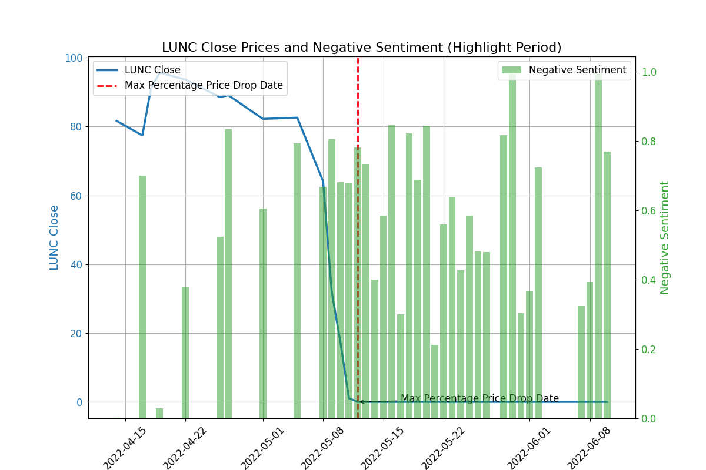
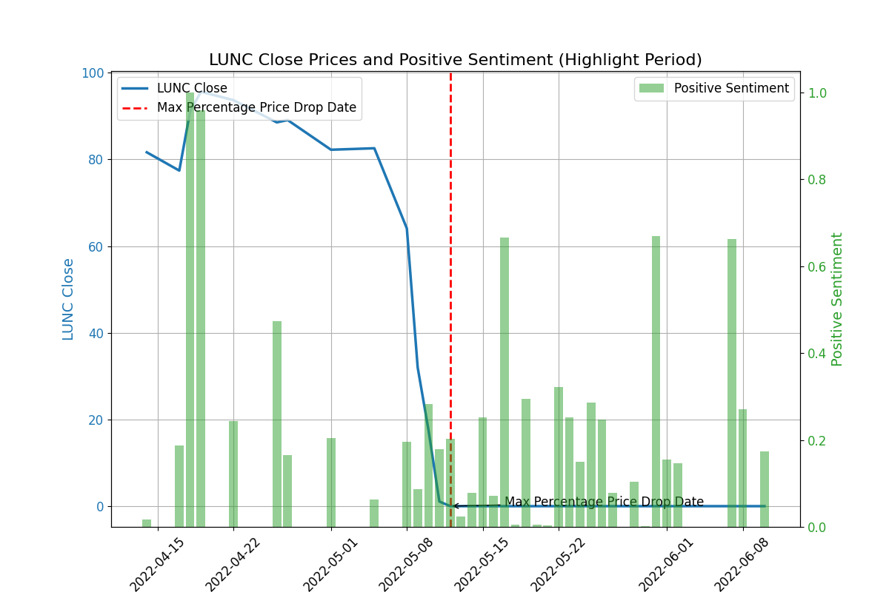
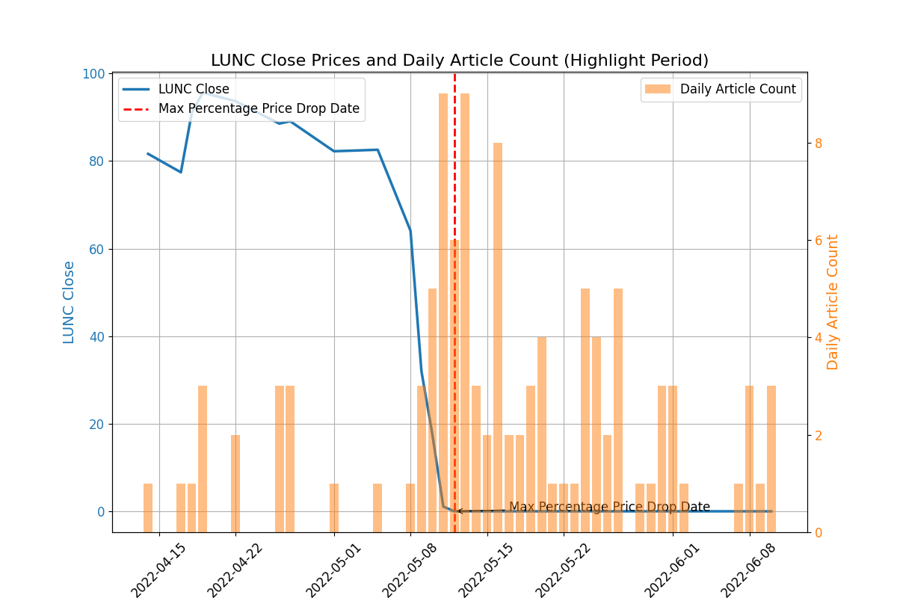
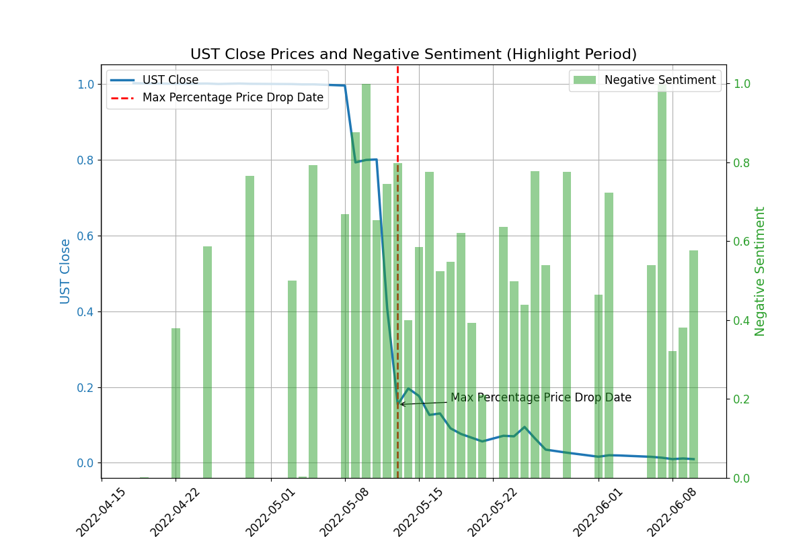
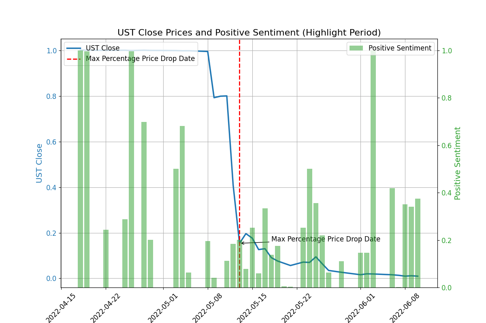
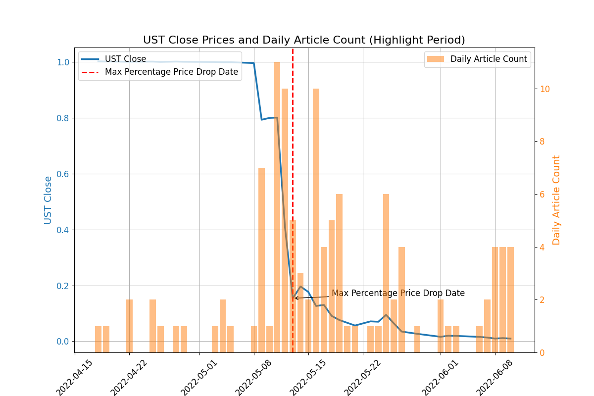

# Investigate the differences in sentiment of articles reporting cryptocurrencies before and after their collapses
Author: Junruo Zhu (20-728-101)

Supervisor: Dr. Sumit Kumar Ram

Date: 29 May 2024

## 1. Introduction

Cryptocurrencies are digital or virtual currencies that use cryptography for security and operate independently of a central bank. They play a significant role in modern finance by enabling decentralized transactions and investment opportunities. Moreover, cryptocurrencies have become a popular topic amongst investors because of their rapid price growth (Rognone et al., 2020, p. 1). An increasing number of researchers have explored the relationship between the price of a cryptocurrency and news reporting on the cryptocurrency to have a clearer understanding of the cryptocurrency market, and their findings have provided valuable insights and references for investors to make informed investment decisions.

Rognone, Hyde, and Zhang (2020) explored the influence of news sentiment on financial markets and discovered a unique characteristic of cryptocurrencies, specifically Bitcoin. Indeed, their study revealed that Bitcoin’s price reacts positively to both positive and negative news, which is different from traditional currencies’ price reactions. This phenomenon suggests that factors rather than news sentiment would influence investor enthusiasm for Bitcoin. In this vein, Corbet et al. (2020) further investigated the impact of macroeconomic news on cryptocurrency returns. They found that positive news regarding unemployment rates and durable goods, which usually increase equity returns, decreases Bitcoin returns. In contrast, negative news on the two macroeconomic indicators increases Bitcoin returns. However, they did not find any statistically significant relationship between Bitcoin returns and news related to GDP and CPI. These findings imply that Bitcoin’s price is selectively sensitive to specific types of macroeconomic news.

To explore whether other cryptocurrencies react to news in the same way as Bitcoin does, case studies of notable cryptocurrency events, such as the collapses of Terra-Luna and FTX, were conducted. Briola, Vidal-Tomás, Wang, and Aste (2022) analyzed the events leading to the Terra-Luna crisis, discovering the role of news sentiment. They found that during the Terra-Luna collapse, negative news significantly raised selling pressure and intensified price fluctuations. However, they did not observe the existence of herding behavior during the collapse. Similarly, Vidal-Tomás, Briola, and Aste (2023) found that negative news related to Terra-Luna influenced FTX’s liquidity and caused FTX’s price crashes. Additionally, negative news accelerated the market’s reaction.

In May 2020, the stablecoin TerraUSD (UST, TerraClassicUSD, and USTC) and its sister token Terra-Luna (LUNC) encountered collapses. Specifically, Luna’s price dropped from over $120 per coin to almost zero, resulting in a loss of over $50 billion in market capitalization of UST/LUNA (_What Happened to Terra?_). Similarly, another cryptocurrency FTX (FTT) collapsed in November 2022 after an article from Coindesk reported that FTT cannot be easily exchanged for cash, and its price dropped from $30 to around $1 (_The Collapse of FTX_).

The aforementioned studies illustrate the impact of negative news reporting a cryptocurrency on the cryptocurrency’s price. However, in these studies, the sentiment scores of news were mainly manually assigned by researchers according to some criteria. The current project aims to calculate the sentiment scores by a large language model – BERT – in order to assign a more objective sentiment value to news. Thus the research question is whether sentiment conveyed in news reports on cryptocurrencies UST, FTX, and LUNC changed significantly before and after their price collapses. After yielding the sentiment scores of each article, this study uses a two-sample t-test to test whether there are significant differences before and after the collapses for each cryptocurrency.

## 2. Data and Method

To answer the research question, I built a dataset consisting of two sub-datasets. One consists of the prices of FTX, UST, and LUNC in the period of 2022 from the website Coindesk, and the other includes the financial articles reporting these coins in 2022 from the website Yahoo Finance. The datasets are formatted as follows: the article dataset is a txt file that includes columns for main content, date, and URL, while the price dataset is a txt file that includes columns for close price and date. The size of the dataset is illustrated in Table 1 below. For more information about the format of the input data (the datasets), please read the README.md.

To investigate whether sentiment conveyed in news reports on cryptocurrencies UST, FTX, and LUNC changed significantly before and after their price collapses, I first preprocessed input article data to remove noise that could influence the results of sentiment analysis. Later, I used a pre-trained BERT-based model named `“mrm8488/distilroberta-finetuned-financial-news-sentiment-analysis”` to compute the sentiment score of each preprocessed text. The result is a probability distribution showing the percentages of positive, neutral, and negative sentiments of a text. 

Subsequently, I saved the sentiment results, including dates, sentiment scores, etc., in a new txt file within the datasets folder. For more information about the format of the sentiment results, please read the README.md. Then, for each coin, I plotted three types of graphs; specifically, one showed the price and negative sentiment scores, another demonstrated the prices and positive sentiment scores, and a third illustrated the daily number of articles and prices. In each plot, I used a function that first calculated the percentage drop in price by comparing the current day's price to the previous day's price, and then found the date on which this change was the largest and marked that date by a line named Max Percentage Price Drop Date shown in the plot. The max percentage price drop date could be interpreted as the price crash or price collapse date in the current study. 

Additionally, to make a reference for the reaction of media coverage to price collapses, I plotted the daily number of articles and prices for each coin and also tested the significance of article numbers before and after the collapses. For each coin, the graphs were saved in a sub-folder named after the coin within the results folder. 

Finally, I utilized two-sample t-tests at a 95% confidence level to test the significance of differences in sentiment scores (negative and positive) and daily article numbers respectively before and after the price crash for each coin. The statistical test results are only shown in the terminal.

**Table 1. Dataset Size**

|                          | **FTX Sub-dataset** | **LUNC Sub-dataset** | **UST Sub-dataset** |
|--------------------------|-----------------|------------------|-----------------|
| **Total Words of Articles** | 444,301         | 227,999          | 209,046         |
| **Total Article Numbers**   | 575             | 269              | 271             |
| **Total Days of Price Data**| 365             | 365              | 365             |

## 3. Results

For FTX, the price and negative sentiment scores, the price and positive sentiment scores, and the daily number of articles and prices are shown in Figures 1, 2, and 3, and the results of t-tests are shown in Table 2. The results indicate that for FTX, 

1. there are significant differences in negative sentiments before and after the collapse;
2. there are no significant differences in positive sentiments before and after the collapse;
3. there are significant differences in daily article counts before and after the collapse.

**Table 2. T-Test Results for FTX**

| **Test**                | **T-Statistic** | **P-Value** |
|---------------------|-----------------|-------------|
| Negative Sentiment  | -2.082          | **0.045**   |
| Positive Sentiment  | 1.490           | 0.147       |
| Daily Article Count | -4.108          | **0.000**   |

**Figure 1. Price and Negative Sentiment Distributions for FTX **

**Figure 2. Price and Positive Sentiment Distributions for FTX **

**Figure 3. Price and Daily Article Number Distributions for FTX **

For LUNC, the price and negative sentiment scores, the price and positive sentiment scores, and the daily number of articles and prices are shown in Figures 4, 5, and 6, and the results of t-tests are shown in Table 3. The results indicate that for LUNC, 

4. there are no significant differences in negative sentiments before and after the collapse;
5. there are no significant differences in positive sentiments before and after the collapse;
6. there are no significant differences in daily article counts before and after the collapse.

**Table 3. T-Test Results for LUNC**

| **Test**                | **T-Statistic** | **P-Value** |
|---------------------|-----------------|-------------|
| Negative Sentiment  | -0.810          | 0.427   |
| Positive Sentiment  | 1.100           | 0.286   |
| Daily Article Count | -0.336          | 0.740   |

**Figure 4. Price and Negative Sentiment Distributions for LUNC **

**Figure 5. Price and Positive Sentiment Distributions for LUNC **

**Figure 6. Price and Daily Article Number Distributions for LUNC **

For UST, the price and negative sentiment scores, the price and positive sentiment scores, and the daily number of articles and prices are shown in Figures 7, 8, and 9, and the results of t-tests are shown in Table 4. The results indicate that for UST, 

7. there are no significant differences in negative sentiments before and after the collapse;
8. there are no significant differences in positive sentiments before and after the collapse;
9. there are no significant differences in daily article counts before and after the collapse.

**Table 4. T-Test Results for UST**

| **Test**                | **T-Statistic** | **P-Value** |
|---------------------|-----------------|-------------|
| Negative Sentiment  | -0.648          | 0.524   |
| Positive Sentiment  | 1.612           | 0.122   |
| Daily Article Count | -0.131          | 0.897   |

**Figure 7. Price and Negative Sentiment Distributions for UST **

**Figure 8. Price and Positive Sentiment Distributions for UST **

**Figure 9. Price and Daily Article Number Distributions for UST **

## 4. Discussion

For FTX, the t-test results indicate significant differences in daily article counts before and after the collapse, which establishes a clear reference for the reaction of media coverage to the FTX price collapse. Following this, I further examined positive and negative sentiment scores separately and found significant differences in negative sentiments. This indicates a notable distinction in negative perceptions between pre-collapse and post-collapse. In contrast, no changes in positive sentiments were observed, which indicates that positive perceptions remained stable. These findings highlight the pronounced differences in negative sentiment conveyed in media regarding FTX before and after the collapse. This is perhaps because of the larger number of collected articles reporting FTX in the dataset, which may offer more information for the significance tests. Additionally, as mentioned in the introduction, the news coverage highlighting the risk of exchanging FTX for cash may trigger the FTX’s collapse, and this indicates that the sentiment of articles before and after the collapse could be significantly different.

For LUNC and UST, the t-test results indicate that there were no significant differences in daily article counts, negative sentiment, or positive sentiment before and after the collapses of LUNC and UST respectively. These findings reveal that despite the notable price crash of UST and LUNC, the news coverage on these coins did not change significantly regarding the number of reports and the sentiment perceptions conveyed in the reports. The unfound significant differences separately in UST and LUNC before and after their collapses are perhaps because of the limited number of news reports in the current dataset. 

For future research, I recommend conducting a study on more cryptocurrencies. This would provide a more comprehensive view of the relationship between price collapse and media coverage across different cryptocurrencies; by analyzing a larger dataset, researchers could identify patterns and correlations. Additionally, expanding the time length for analysis from 30 days to 90 days before and after the collapse could offer more information on the long-term effects of the collapse.

## 5. Conclusion

In order to further investigate whether sentiment conveyed in news reports on cryptocurrencies UST, FTX, and LUNC changed significantly before and after their price collapses, I built a dataset including price data and articles reporting the cryptocurrencies for each cryptocurrency. By utilizing a pre-trained BERT-based model to compute the sentiment scores of articles and two sample t-tests for significance tests, the results show that for FTX, the negative sentiment of the corresponding articles was significantly different before and after the collapse, while no significant differences were observed in the positive sentiments for FTX. For LUNC and UST, there were no significant differences in the daily article counts, and consequently, no significant differences in positive and negative sentiment scores were observed.

By exploring the differences in sentiment value shown in news reports before and after the collapses of three cryptocurrencies, I found that the sentiment conveyed in news coverage of a specific cryptocurrency could not be an indicator of investment because not every news coverage reporting on a cryptocurrency show notable differences before and after the collapse and the number of existing news reports are not abundant for analysis.

## References
1. Chat GPT 4.0: For generating partial scripts and gramma correction of the technical documentation.
2. [mrm8488/distilroberta-finetuned-financial-news-sentiment-analysis] (https://huggingface.co/mrm8488/distilroberta-finetuned-financial-news-sentiment-analysis): For sentiment analysis of financial news articles.

## Bibliography

Briola, A., Vidal-Tomás, D., Wang, Y., & Aste, T. (2023). Anatomy of a Stablecoin’s failure: The Terra-Luna case. _Finance Research Letters_, 51, 103358. https://doi.org/10.1016/j.frl.2022.103358

Corbet, S., Larkin, C., Lucey, B., Meegan, A., & Yarovaya, L. (2020). Cryptocurrency reaction to FOMC Announcements: Evidence of heterogeneity based on blockchain stack position. _Journal of Financial Stability_, 46, 100706. https://doi.org/10.1016/j.jfs.2019.100706

Rognone, L., Hyde, S., & Zhang, S. S. (2020). News sentiment in the cryptocurrency market: An empirical comparison with Forex. _International Review of Financial Analysis_, 69, 101462. https://doi.org/10.1016/j.irfa.2020.101462

_The Collapse of FTX: What Went Wrong With the Crypto Exchange?_. Investopedia. Retrieved May 29, 2024, from https://www.investopedia.com/what-went-wrong-with-ftx-6828447

Vidal-Tomás, D., Briola, A., & Aste, T. (2023). FTX’s downfall and Binance’s consolidation: The fragility of centralised digital finance. _Physica A: Statistical Mechanics and Its Applications_, 625, 129044. https://doi.org/10.1016/j.physa.2023.129044

_What Happened to Terra?_. Corporate Finance Institute. Retrieved May 29, 2024, from https://corporatefinanceinstitute.com/resources/cryptocurrency/what-happened-to-terra/
